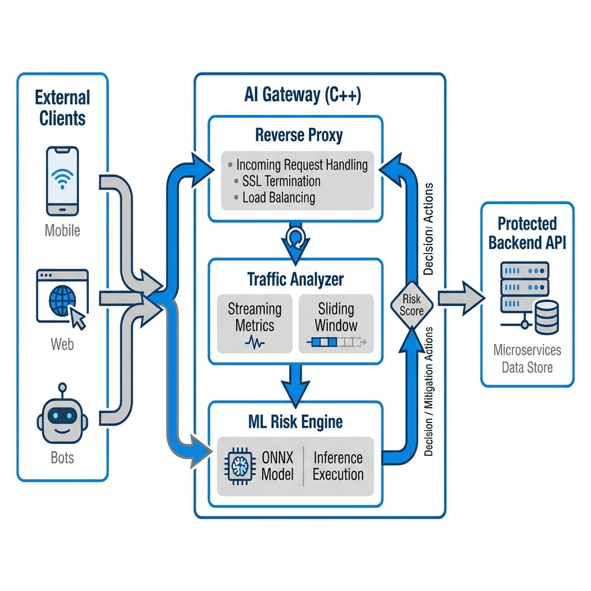

# AI-Powered API Abuse Detection Gateway

**Protect your APIs from bots, scrapers, and DDoS attacks in minutes. Zero backend changes required.**

[](https://opensource.org/licenses/MIT)
[](https://en.cppreference.com/w/cpp/20)
[](https://www.docker.com/)
[](https://www.mkdocs.org/)

A high-performance C++ API Gateway that uses real-time behavioral analysis and Machine Learning to detect and block abusive traffic (bots, scrapers, DDoS) without modifying the backend.

---

## Full Documentation

** [Read the complete docs](https://yourusername.github.io/AI-Gateway)** (or run `mkdocs serve` locally)

### Quick Links

- [5-Minute Quick Start](docs/getting-started/quickstart.md)
- [Protect Your Vercel Backend](docs/use-cases/vercel-integration.md) - Real example!
- [Configuration Guide](docs/getting-started/configuration.md)
- [FAQ](docs/faq.md)
- [Contributing](docs/contributing.md)

---

## Real-World Example: sans's Story

**sans** built an e-commerce site with Next.js + Node.js backend on Vercel. After launch, bots started scraping her product API 1000x/minute, causing:

- Server costs jumped 400%
- Real customers got slow responses
- Frustration and lost sales

**Solution:** She deployed this gateway in **10 minutes**. Now:

 Bots automatically blocked 
 Server costs back to normal 
 Real customers happy 
 Live analytics dashboard

**[See her complete setup guide →](docs/use-cases/vercel-integration.md)**

---

## System Architecture



The system is designed with a modular architecture:

- **Gateway Layer (src/gateway)**: Handles incoming HTTP requests and enforcement (Allow/Block).
- **Traffic Analysis (src/analysis)**: Thread-safe streaming metrics (RPS, Burstiness) per client in O(1) time.
- **ML Engine (src/ml)**: Advanced rule-based scoring with ONNX Runtime support for custom models.
- **Authentication (src/auth)**: Session-based user management for dashboard access.
- **Utils**: High-speed logging and configuration.

## Quick Start (5 Minutes)

### Step 1: Deploy the Gateway

```bash
# Clone repo
git clone https://github.com/yourusername/AI-Gateway.git
cd AI-Gateway

# Build with Docker
docker build -t gateway .

# Run (protecting your API)
docker run -d -p 8080:8080 \
 -e BACKEND_URL=https://your-api.vercel.app \
 --name gateway \
 gateway
```

### Step 2: Update Your Frontend

Change API calls to use gateway:

```javascript
// Before
const API_BASE = 'https://your-api.vercel.app';

// After 
const API_BASE = 'https://your-gateway.com'; // or http://localhost:8080
```

### Step 3: Monitor Dashboard

1. Visit: `http://localhost:8080/dashboard/signup.html`
2. Create account & login
3. See live traffic + blocked attacks!

**That's it!** Your API is now protected.

 **[See detailed guide with real example →](docs/use-cases/vercel-integration.md)**

---

## Dashboard

Real-time monitoring of traffic and threats:

- Live RPS graphs
- Active client list with risk scores
- Endpoint diversity analysis
- Error rate tracking
- Ban management

Access at: `http://localhost:8080/dashboard/index.html`

---

## Configuration

### Basic Setup

Edit `config/config.json`:

```json
{
 "gateway": {
 "backend_url": "https://your-api.com"
 },
 "ml_model": {
 "threshold_block": 0.8,
 "threshold_throttle": 0.5,
 "ban_duration_seconds": 300
 }
}
```

### Environment Variables

```bash
docker run -d -p 8080:8080 \
 -e BACKEND_URL=https://your-api.com \
 -e BLOCK_THRESHOLD=0.85 \
 gateway
```

 **[Full configuration reference →](docs/getting-started/configuration.md)**

---

## ML Model Training (Optional)

The gateway works great with built-in rule-based detection. For advanced use:

```bash
# Install Python dependencies
pip install scikit-learn skl2onnx numpy onnx

# Generate custom model
python tools/create_sample_model.py
 Use Cases

Perfect for:

- **E-commerce** - Block price scrapers & inventory bots
- **Mobile Apps** - Prevent fake API clients
- **SaaS** - Stop credential stuffing attacks
- **Web APIs** - Protect content from theft
- **Microservices** - Internal service protection

 **[See real examples →](docs/use-cases/vercel-integration.md)**

---

## Architecture

```
Users → Gateway → Your API
 ↓
 Analysis
 ↓
 ML Scoring
 ↓
 Allow/Throttle/Block
```

**Components:**

- **Gateway Layer** - Request handling & enforcement
- **Traffic Analysis** - Thread-safe behavioral tracking
- **ML Engine** - Real-time risk scoring (rule-based + ONNX)
- **Auth System** - Dashboard access control
- **Ban Manager** - Auto-expiring temporary blocks

 **[Architecture deep dive →](docs/advanced/architecture.md)**

---

## Project Structure

```
 src/
 gateway/ # ReverseProxy, Dashboard, Auth, BanManager
 analysis/ # TrafficAnalyzer, SlidingWindow
 ml/ # InferenceEngine (ML scoring)
 auth/ # UserManager (sessions)
 main.cpp # Entry point
 config/ # config.json
 dashboard/ # Web UI (HTML/JS)
 docs/ # MkDocs documentation
 tools/ # Model generation scripts
 Dockerfile # Multi-stage buildom ML model inference.
- **CMake**: Build System.

## Key Features

 **Production-Ready ML Engine**
- Advanced multi-factor risk scoring algorithm
- Thread-safe concurrent inference
- Automatic fallback if model unavailable
- ONNX Runtime integration ready

 **Thread-Safe Architecture**
- Mutex-protected client statistics
- Lock-free read operations
- Safe concurrent request handling

 **Real-Time Behavioral Analysis**
- 60-second sliding windows
- RPS and burstiness tracking
- Automatic high-risk detection and logging

 **Web Dashboard**
- Live traffic visualization
- Client risk monitoring
- Dynamic backend configuration
- User authentication

## Project Structure

```
 src
 analysis # Sliding Window & Traffic Analyzer
 gateway # Reverse Proxy Logic
 ml # Inference Engine
 main.cpp # Entry Point
 include # Public Headers
 config # JSON Configuration
 Dockerfile # Multi-stage build
 CMakeLists.txt # Build definitions
```
